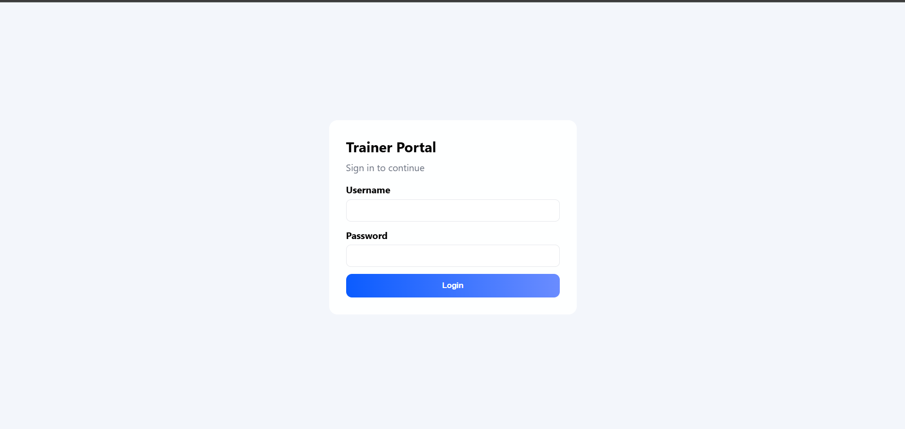
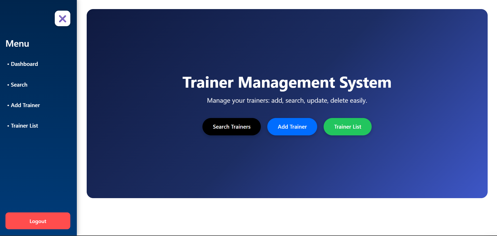
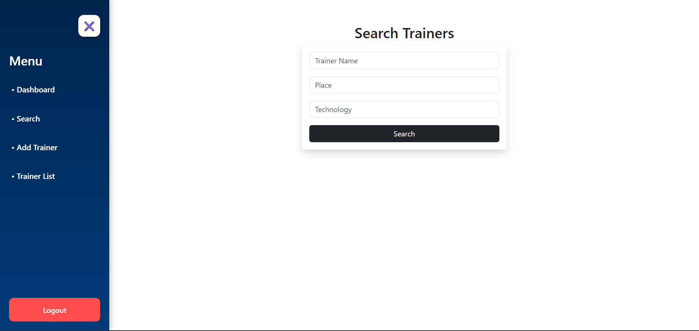
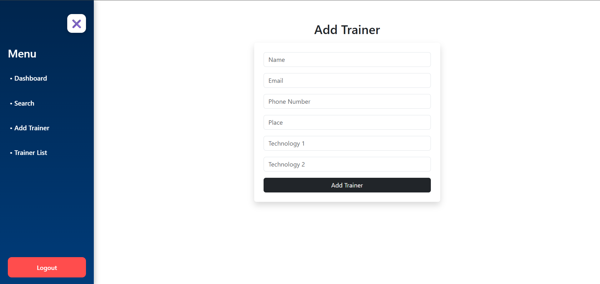
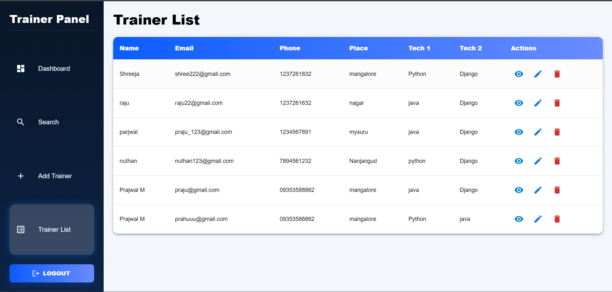

# **Trainer Management System**

A full-stack web application built using **Django REST Framework (backend)** and **React (frontend)**.
It allows authenticated users to **search, add, update, and delete trainer profiles** with a beautiful, responsive UI.

---

##  **Tech Stack**

### **Backend**

* Django
* Django REST Framework
* JWT Authentication (SimpleJWT)
* Trainer CRUD API
* Search, pagination & filtering
* CORS enabled for frontend
* SQLite (default) / MySQL support

### **Frontend**

* React
* Axios for API communication
* React Router for navigation
* Secure login & token storage
* Add/Search/Update/Delete trainers
* Responsive UI components

---

##  **Features**

### **Backend Features**

* Secure JWT Authentication
* CRUD operations for trainers
* Searching trainers by name, technology, or location
* Pagination support
* RESTful API design
* CORS setup for frontend

### **Frontend Features**

* Login authentication
* Dashboard overview
* Add Trainer form
* Search Trainers with filters
* Trainer List with actions (View / Update / Delete)
* Beautiful and responsive UI

---

##  **Project Structure**

```bash
TRAINER-S-SEARCH-APP/
│
├── backend/
│   └── trainers_search_app/
│       ├── myenv/                       # Virtual environment
│       │
│       ├── trainers/                    # Django app (Trainer CRUD)
│       │   ├── __pycache__/
│       │   ├── migrations/
│       │   ├── __init__.py
│       │   ├── admin.py
│       │   ├── apps.py
│       │   ├── models.py
│       │   ├── serializer.py
│       │   ├── tests.py
│       │   ├── urls.py
│       │   └── views.py
│       │
│       ├── trainers_search_app/         # Django project core
│       │   ├── __pycache__/
│       │   ├── __init__.py
│       │   ├── asgi.py
│       │   ├── settings.py
│       │   ├── urls.py
│       │   └── wsgi.py
│       │
│       ├── manage.py
│       └── requirements.txt
│
│
├── frontend/
│   └── trainers/
│       ├── node_modules/
│       ├── public/
│       ├── src/
│       │   ├── components/
│       │   ├── pages/
│       │   ├── api/
│       │   ├── App.jsx
│       │   └── main.jsx
│       │
│       ├── .gitignore
│       ├── eslint.config.js
│       ├── index.html
│       ├── package-lock.json
│       ├── package.json
│       ├── README.md
│       ├── vite.config.js
│       └── images/                      # UI screenshots
│
├── .gitignore
└── README.md
```

---

##  **Getting Started**

###  **Backend Setup (Django)**

1. Clone the repository

   ```bash
   git clone https://github.com/PrajwalM20/NIE-training-.git
   cd NIE-training-
   ```

2. Create and activate virtual environment

   ```bash
   python3 -m venv venv
   source venv/bin/activate    # Mac/Linux
   venv\Scripts\activate       # Windows
   ```

3. Install dependencies

   ```bash
   pip install -r requirements.txt
   ```

4. Apply migrations

   ```bash
   python manage.py migrate
   ```

5. Create superuser (optional)

   ```bash
   python manage.py createsuperuser
   ```

6. Run development server

   ```bash
   python manage.py runserver
   ```

Your backend runs on:
 **[http://127.0.0.1:8000/](http://127.0.0.1:8000/)**

---

###  **Frontend Setup (React)**

1. Navigate to frontend

   ```bash
   cd frontend/trainers
   ```

2. Install dependencies

   ```bash
   npm install
   ```

3. Run the development server

   ```bash
   npm start
   ```

Frontend runs on:
 **[http://localhost:3000/](http://localhost:3000/)**

---

##  **Authentication Flow**

1. User logs in & receives JWT access + refresh tokens
2. Access token is stored (localStorage)
3. All protected routes require:

   ```
   Authorization: Bearer <token>
   ```
4. Refresh token is used to generate new access token
5. Logout clears all tokens

---

##  **Environment Variables**

### Django

* `DJANGO_SECRET_KEY`
* `CORS_ALLOWED_ORIGINS`
* `DATABASE_URL` (if using MySQL)

### React

* `REACT_APP_API_BASE_URL`

---

##  **Testing Workflow**

1. Login → verify tokens
2. Add trainer → appears in list
3. Search trainers → filtered results
4. Update trainer → reflect changes
5. Delete trainer → removed from table
6. Logout → protected pages blocked

---

##  **Future Enhancements**

* Admin vs User role-based access
* Search by experience & skill level
* Pagination UI improvements
* Trainer image upload support
* Dark mode / theme toggle
* Deployment (Docker + Nginx + Gunicorn)

---

##  **Screenshots**

###  Login Page



---

###  Dashboard



---

###  Search Trainers



---

###  Add Trainer



---

###  Trainers List



---

##  Contribution

This project is open for contributions!
Fork → Improve → Pull Request.

---

##  About

**Trainer Management System** — a powerful full-stack trainer directory application built using **Django REST Framework** and **React**.

---
